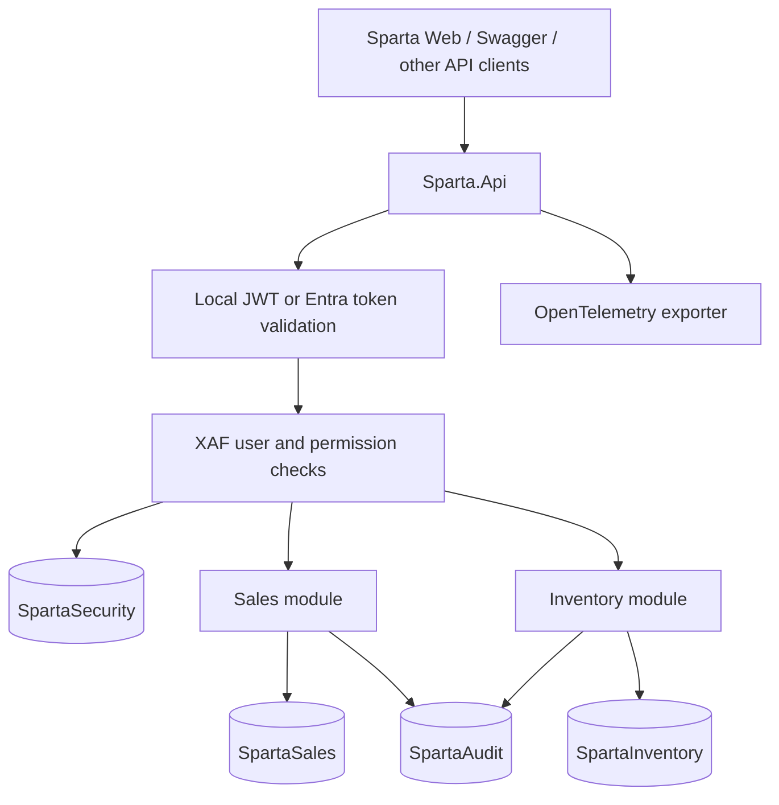

# How to implement Sparta.Api

A practical guide to the code in this repository, reviewed on 19 September 2026. Examples use PowerShell from `D:\Codex\Build Sparta Api`. The final extension exercise is a proposed change, not an already implemented feature.

## 1. Understand the application first

Sparta.Api is one ASP.NET Core application containing several business modules. Sales and Inventory share authentication and XAF permissions, but each owns its business database. This is a **modular monolith**: modules run in the same process and are deployed together.

The API uses .NET 10, DevExpress XAF Web API 26.1.4 and EF Core 8.0.28. The EF version is deliberately pinned; targeting .NET 10 does not mean this repository uses EF Core 10. See `global.json` and `Directory.Build.props` before changing versions.

There is no XAF Blazor, XAF WinForms or XAF Middle Tier application. The separate Sparta Web project is a custom UI that consumes this API.



Separate databases provide ownership boundaries. They do not automatically provide separate deployments, distributed transactions, or reliable cross-database workflows.

### Where code belongs

| Project | Put this code here |
|---|---|
| `Sparta.Api` | HTTP endpoints, authentication wiring, dependency injection, database migrations and provisioning commands |
| `Sparta.Security` | XAF application users, external login links and the security context |
| `Sparta.Modules.Sales` | Sales entities, relationships and Sales database configuration |
| `Sparta.Modules.Inventory` | Inventory entities, stock rules and Inventory database configuration |
| `Sparta.SharedKernel` | Common entity lifecycle, attribution validation and small cross-module contracts |
| `Sparta.Audit` | Audit database, audit metadata and filtering |
| `Sparta.ServiceDefaults` | Telemetry and health-check defaults |
| `Sparta.AppHost` | Aspire development orchestration |
| `Sparta.IntegrationTests` | Executable integration checks against configured SQL databases |

Read these files in order: `src/Sparta.Api/Program.cs`, `Startup.cs`, `src/Sparta.SharedKernel/Entity.cs`, the module `Entities.cs` files, `DatabaseUpdate/PocSeeder.cs`, then `API/BusinessController.cs`.

## 2. Learn the five important concepts

**Authentication** answers “Who are you?” Local login checks an XAF username/password and issues a JWT. Entra login validates an Entra access token and maps its identity to an existing XAF account.

**Authorization** answers “What may you do?” XAF roles control entity types, individual objects and individual members. A valid token does not mean unrestricted database access.

**DbContext** describes the SQL model and persistence behavior of a database. There are four contexts because there are four database responsibilities.

**ObjectSpace** is the XAF unit of work used for querying, creating and saving objects. In request handlers, obtain it from `IObjectSpaceFactory`. The configured secured providers connect data access to the current user's permissions.

**CommitChanges()** saves an ObjectSpace's pending changes. Entity lifecycle hooks and database validation participate in saving; Sales and Inventory providers also produce audit records.

Use `INonSecuredObjectSpaceFactory` only for deliberate administrative operations such as provisioning. Copying the seeder's nonsecured access into a business controller would bypass the intended authorization boundary. Direct DbContext access also does not automatically inherit request-level XAF protection.

### Example request: update a product

1. The client sends a bearer token and its original product `RowVersion`.
2. ASP.NET Core validates the token; XAF resolves the user and permissions.
3. `ProductCommandsController` opens a secured Product ObjectSpace.
4. The controller checks visibility and permission to write each requested member.
5. It compares the supplied row version with the current database value.
6. It assigns permitted values and calls `CommitChanges()`.
7. Inventory persists the product; the audited provider writes audit history.
8. The client reloads the product to obtain its new row version.

## 3. Understand the data model

| Database | Main data | Reason |
|---|---|---|
| `SpartaSecurity` | ApplicationUser, login links, roles, type/object/member permissions | One identity and RBAC source for all modules |
| `SpartaSales` | Customer, SalesOrder, SalesOrderLine | Sales owns its business records |
| `SpartaInventory` | Product, Warehouse, StockMovement | Inventory owns its product and stock records |
| `SpartaAudit` | Native XAF audit items and weak references | Central audit storage with module-specific access |

Business entities inherit `Entity` and use an integer identity key named `Id`. Native XAF security and audit entities retain their native keys.

Every business entity also has:

| Property | Meaning |
|---|---|
| `CreatedByUserId` | Stable XAF user GUID; used by ownership rules |
| `CreateByUserName` | Username snapshot at creation; exact spelling used in this code |
| `CreatedAtUtc` | Creation time assigned by the server |
| `RowVersion` | SQL concurrency token, represented as base64 in JSON |

Keeping both user ID and username allows readable history without breaking ownership when a username changes. New request-created entities receive attribution from the authenticated identity. Existing creation attribution is immutable. Administrative seed operations have no ordinary signed-in request user, so do not assume seed records belong to the account that later logs in.

### Sales relationships

`Customer → SalesOrder → SalesOrderLine` uses relationships inside SpartaSales. A line references an Inventory product by integer `ProductId`, plus code/name snapshots. There is no cross-database EF navigation or SQL foreign key to Product.

`IProductCatalog` is the narrow cross-module contract. Its Inventory implementation uses secured access, so a user creating a line needs suitable Inventory access as well as Sales access. `sales.operator` demonstrates this combination. Historical line references and snapshots cannot be changed after creation.

Creating or confirming an order currently does **not** automatically issue inventory stock.

### Inventory relationships and rules

Each StockMovement references a Product and Warehouse. Stock on hand is the sum of `QuantityDelta` grouped by product and warehouse; it is not a manually edited balance column.

Movements must have a nonzero quantity, at most three decimal places, a reference and a valid occurrence date. The current validation permits up to one minute of future clock difference. New movements require active product/warehouse references. Posted movements cannot be modified or deleted, including through ordinary context saves: post a correcting movement instead.

The implementation does not yet establish a complete reservation or negative-stock prevention workflow. Products and warehouses with movement history should be deactivated instead of deleted.

## 4. Prepare and run the development environment

Install the SDK selected by `global.json`, provide access to the licensed DevExpress packages, and make the SQL Server reachable. The configured development server is `BGALT-NAP02`.

For a **new local setup**, run:

```powershell
Set-Location 'D:\Codex\Build Sparta Api'
$env:ASPNETCORE_ENVIRONMENT = 'Development'
./scripts/Initialize-Local.ps1 -Server BGALT-NAP02 -UserName sa
dotnet tool restore
dotnet build Sparta.sln
dotnet run --project src/Sparta.Api -- --migrate
dotnet run --project src/Sparta.Api -- --seed
dotnet run --project src/Sparta.Api --launch-profile http
```

The script prompts for the SQL password and stores development configuration outside the repository. Do not put database passwords or signing keys in this tutorial or committed appsettings files. User Secrets are a development convenience, not encrypted production secret storage.

If this machine is already configured, skip initialization. The script generates a new configured `Seed:Password` when the existing value is missing **or empty**. Despite its preservation message, it does not preserve an empty value. It does not reset existing database user passwords.

| Configuration key | Purpose |
|---|---|
| `ConnectionStrings:Security` | Security database connection |
| `ConnectionStrings:Sales` | Sales database connection |
| `ConnectionStrings:Inventory` | Inventory database connection |
| `ConnectionStrings:Audit` | Audit database connection |
| `Authentication:Jwt:IssuerSigningKey` | Local JWT signing secret |
| `Seed:Password` | Password assigned when seed accounts are created or explicitly reset |
| `Authentication:Local:Enabled` | Enable local login and local bearer validation |
| `Authentication:Entra:*` | Entra validation and Swagger OAuth configuration |

Environment variables use double underscores, for example `ConnectionStrings__Inventory`. The migration context factories read User Secrets and environment variables, so appsettings alone is not sufficient for those factories.

`--migrate` applies migrations for all four contexts and exits. `--seed` provisions development data and exits. Normal API startup does not migrate or seed automatically. Seeding is restricted to Development.

With the direct HTTP launch profile, open [Swagger](http://localhost:5180/swagger/index.html), [liveness](http://localhost:5180/alive) and [database readiness](http://localhost:5180/health). Swagger and these health endpoints are mapped in Development in the current code.

## 5. Understand seeded users and passwords

The implementation is `PocSeeder.Seed(...)` in `src/Sparta.Api/DatabaseUpdate/PocSeeder.cs`.

| Username | Principal role(s) | Intended test |
|---|---|---|
| `admin` | PlatformAdministrator, Platform.Audit.Read | Administrative access |
| `sales.reader` | Sales.Reader, Sales.Audit.Read | Read Sales; restricted internal notes |
| `sales.clerk` | Sales.Clerk, Sales.Audit.Read | Create and work with owned orders |
| `sales.other` | Sales.Clerk, Sales.Audit.Read | Verify isolation from another clerk |
| `sales.operator` | Sales.Clerk, Inventory.Reader, Sales.Audit.Read | Sales lines with permitted product lookup |
| `sales.manager` | Sales.Manager, Sales.Audit.Read | Manage Sales records |
| `inventory.reader` | Inventory.Reader, Inventory.Audit.Read | Read inventory without StandardCost |
| `inventory.manager` | Inventory.Manager, Inventory.Audit.Read | Manage inventory; movement immutability still applies |
| `both.reader` | Sales.Reader, Inventory.Reader and both audit roles | Read across modules |

`Inventory.Manager` is a role name, **not** a default password. New accounts receive `Seed:Password`; the seeder falls back to an empty string if the setting is absent. This workspace's README records an earlier explicit reset to empty passwords, but the database's actual current password depends on subsequent changes.

Ordinary `--seed` preserves existing passwords and existing users' role assignments. Changing `Seed:Password` alone does not update existing accounts. To deliberately reset all nine named seed accounts in a development database:

```powershell
dotnet run --project src/Sparta.Api -- --seed --reset-seed-passwords
```

Only run that command when a reset is intended. It uses the configured seed password. An empty configured value means an empty password.

Seeding is not full database reconciliation: initial permissions are largely inside a “Sales.Reader has no type permissions” guard, and example inventory data is only inserted when no Product exists. Rerunning it does not necessarily add every newly introduced permission or missing sample record.

## 6. Log in and explore the API

In Swagger, execute `POST /api/Authentication/Authenticate` with:

```json
{
  "userName": "inventory.manager",
  "password": "<actual account password>"
}
```

Use `"password": ""` only when that account actually has an empty password. The response is the token string, not an `{ access_token: ... }` object. Use the JWT bearer authorization entry, paste the token without JSON quotation marks, and call `GET /api/session`.

Local tokens currently expire after 30 minutes. Log in again after expiry. The session response supplies username, roles and Inventory/Warehouse/Movement capabilities; record permission endpoints provide more specific checks. UI button visibility is convenience, while API authorization remains mandatory.

For a simple authenticated read, the supplied helper obtains the configured seed password without printing it:

```powershell
./scripts/Invoke-PocRequest.ps1 -UserName inventory.reader `
    -Path '/api/odata/Product?$select=Id,Code,Name&$top=10'
```

Use single quotes around PowerShell OData paths so `$select`, `$filter` and `$top` are not interpreted as variables. The helper fails to log in if the account password has diverged from the configured seed password.

### Which endpoints should I use?

| Endpoint | Purpose |
|---|---|
| `/api/odata/Customer` | Generated Customer operations |
| `/api/odata/SalesOrder` | Generated SalesOrder operations |
| `/api/odata/SalesOrderLine` | Generated SalesOrderLine operations |
| `/api/odata/Product` | Generated Product operations, including reads and creation |
| `/api/odata/Warehouse` | Generated Warehouse operations, including reads and creation |
| `/api/odata/StockMovement` | Generated StockMovement surface; domain rules still apply |
| `GET /api/session` | Current identity and selected UI capabilities |
| `GET /api/inventory/products/{id}/permissions` | Product record capabilities |
| `PUT, DELETE /api/inventory/products/{id}` | Explicit version-aware product commands |
| `GET /api/inventory/warehouses/{id}/permissions` | Warehouse record capabilities |
| `PUT, DELETE /api/inventory/warehouses/{id}` | Explicit version-aware warehouse commands |
| `POST /api/inventory/movements` | Validated movement command |
| `GET /api/inventory/stock` | Secured stock aggregation |
| `POST /api/sales/orders` | Order creation command |
| `GET /api/sales/orders/{id}` | Permission-aware order projection |
| `GET /api/{module}/audit` | Filtered Sales or Inventory audit history |

An OData item uses parentheses, such as `/api/odata/Product(1)`. An OData collection response wraps rows in `value`; custom endpoints can return different shapes. Inspect Swagger schemas rather than assuming identical responses.

Generated endpoints avoid hand-writing routine CRUD controllers. Custom endpoints exist for explicit client concurrency, business commands, safe projections, aggregations and audit access. Do not add a duplicate custom CRUD endpoint merely because a new entity exists.

The explicit product/warehouse commands require the version the client originally edited. Do not assume generated OData updates have exactly the same version contract just because the entity has `RowVersion`.

## 7. Hands-on lab: create, update and audit a product

This optional lab **writes a product into the configured Inventory database**. Use development data. The commands are examples; writing this tutorial does not execute them.

Use PowerShell 7. The example reads local User Secrets into memory, logs in, and never prints the password or token. It assumes the account still uses the configured seed password.

```powershell
$baseUrl = 'http://localhost:5180'
$secretPath = Join-Path $env:APPDATA 'Microsoft/UserSecrets/sparta-architecture-poc/secrets.json'
$settings = Get-Content $secretPath -Raw | ConvertFrom-Json -AsHashtable
$loginBody = @{
    userName = 'inventory.manager'
    password = [string]$settings['Seed:Password']
} | ConvertTo-Json
$token = Invoke-RestMethod "$baseUrl/api/Authentication/Authenticate" `
    -Method Post -ContentType 'application/json' -Body $loginBody
$headers = @{ Authorization = "Bearer $token" }
Invoke-RestMethod "$baseUrl/api/session" -Headers $headers

$code = 'LEARN-' + [guid]::NewGuid().ToString('N').Substring(0, 12)
$newProduct = @{
    Code = $code
    Name = 'Tutorial product'
    UnitOfMeasure = 'PCS'
    StandardCost = 100
    IsActive = $true
} | ConvertTo-Json
Invoke-RestMethod "$baseUrl/api/odata/Product" -Method Post `
    -Headers $headers -ContentType 'application/json' -Body $newProduct | Out-Null

# Query by our unique code, rather than assuming the generated ID.
$query = '/api/odata/Product?$filter=Code%20eq%20%27' + $code + '%27'
$page = Invoke-RestMethod ($baseUrl + $query) -Headers $headers
$product = @($page.value)[0]
if ($null -eq $product) { throw 'Created product was not found.' }
$productId = $product.Id

$edit = @{
    Code = $product.Code
    Name = 'Tutorial product updated'
    UnitOfMeasure = $product.UnitOfMeasure
    IsActive = $product.IsActive
    StandardCost = 125
    RowVersion = $product.RowVersion
} | ConvertTo-Json
Invoke-RestMethod "$baseUrl/api/inventory/products/$productId" `
    -Method Put -Headers $headers -ContentType 'application/json' -Body $edit

Invoke-RestMethod "$baseUrl/api/odata/Product($productId)" -Headers $headers
Invoke-RestMethod "$baseUrl/api/inventory/audit?entityType=Product&entityId=$productId" `
    -Headers $headers
```

Expected result: creation succeeds, update returns 204, the refreshed product has a different row version, and its readable audit changes are available. Repeating the same PUT with the old `$edit` should return 409. Reload, let the user reconcile the changes, and submit the new version; do not silently overwrite another user's edit.

Repeat read and write attempts as `inventory.reader`: verify that cost is not disclosed and mutations are denied. Collection filtering can legitimately produce HTTP 200 with no visible rows; successful HTTP status alone does not prove unrestricted access.

To post stock, choose an existing active warehouse ID and use `POST /api/inventory/movements`:

```json
{
  "productId": 123,
  "warehouseId": 1,
  "quantityDelta": 10,
  "occurredAt": "<current UTC timestamp in ISO 8601 format>",
  "reference": "Tutorial receipt"
}
```

Replace both IDs and the timestamp; the example values are not guaranteed seed IDs. Read `/api/inventory/stock` to see the aggregate. Correct mistakes with another movement. For product/warehouse DELETE commands, send the most recently read base64 version in `If-Match`; deletion of records with movement history is rejected.

## 8. How RBAC is implemented

Roles start with `DenyAllByDefault`. Grants must deliberately allow access.

| Permission level | Existing example |
|---|---|
| Type | Inventory.Reader may read Product |
| Object | Sales.Clerk may read/write orders where `CreatedByUserId = CurrentUserId()` |
| Member | Inventory.Reader cannot read Product.StandardCost |
| Relationship | A clerk receives the Customer.Orders association permission needed to create orders |

The seeder's `Grant<T>` helper also denies writing creation attribution. Context validation protects its immutability independently. Inventory.Manager's CRUD grant does not override the domain rule that posted movements are immutable.

For custom projections, check protected members before including their values in a DTO. A broad entity read permission is not permission to disclose every member. `BusinessController.GetOrder` demonstrates omitting unreadable InternalNotes.

When extending permissions, do not place all upgrades inside the existing initial-seed guard. Use an explicit, idempotent provisioning change for the affected role and type, and preserve unrelated administrator edits.

## 9. How Entra authentication fits

The current API reads `Authentication:Entra:*`, not an arbitrary top-level `AzureAd` block. `Startup.cs` configures Microsoft.Identity.Web and `EntraAuthentication.cs` validates the delegated token and resolves an XAF account.

The implemented flow is:

1. A client obtains an Entra access token for this API.
2. The API validates signature, issuer, audience, lifetime, tenant, token version and required delegated scope.
3. The tenant GUID and user object GUID identify an external login link.
4. That link resolves an active ApplicationUser in SpartaSecurity.
5. Existing XAF roles authorize the request.

There is no automatic account creation, email matching or Entra-group-to-XAF-role synchronization. App-only tokens are not accepted by this delegated-user implementation.

After configuring the tenant, API application, Swagger client and scope, link a user with the administrative CLI:

```powershell
$tenantId = '<tenant GUID>'
$entraUserObjectId = '<user Object ID in that tenant>'
dotnet run --project src/Sparta.Api -- --link-entra inventory.reader $tenantId $entraUserObjectId
```

Use the **user** Object ID, not the application or service principal Object ID. Linking preserves the Sparta user's roles and refuses reassignment of an existing identity to another account.

Swagger uses authorization code with PKCE and `/swagger/oauth2-redirect.html`. The bearer API itself does not use `/signin-oidc`; an interactive UI can have its own OIDC callback. See `docs/ENTRA.md` for the repository's registration/configuration instructions and verification limits. Token validation tests are not proof that the real tenant's browser consent and redirect configuration works.

## 10. How audit history works

Sales and Inventory secured providers are paired with AuditDbContext using `WithAuditedDbContext`. The native XAF audit entities retain their own keys. AuditDbContext stamps UTC time and a shadow `TraceId` to correlate history with telemetry. SafeAuditFilter excludes properties whose names contain Password or Token; that is a limited naming filter, not a comprehensive sensitive-data classification system.

The audit API requires a module audit role and normally requires access to the business object and individual members. `Platform.Audit.Read` explicitly supports broader audit investigation, including deleted/inaccessible records. An audit role alone does not ordinarily reveal all hidden business values.

Examples:

```text
GET /api/Inventory/audit?entityType=Product&entityId=123&skip=0&take=50
GET /api/Sales/audit?entityType=SalesOrder&entityId=456&skip=0&take=50
```

The entity type must appear in AuditController's allowlist. Results are capped at 100 requested rows. Member filtering happens after raw pagination, so a page can contain fewer visible items than `take`.

**Known consistency limitation:** business and audit saves are separate database commits. The integration fault scenario documents that an audit failure can produce HTTP 500 after the business change has committed. Do not blindly retry a failed write. Re-read state; production workflows need a designed recovery mechanism, such as an outbox plus idempotent commands. Central storage alone does not make auditing transactionally atomic.

## 11. Exercise: add an InventoryCategory entity

This exercise teaches the implementation pattern. InventoryCategory is **not currently implemented**. It belongs to the existing Inventory module and database; do not create another service or database for it.

### Step A: define the entity

Create `src/Sparta.Modules.Inventory/InventoryCategory.cs`:

```csharp
using System.ComponentModel.DataAnnotations;
using Sparta.SharedKernel;

namespace Sparta.Modules.Inventory;

public class InventoryCategory : Entity {
    [Required, MaxLength(32)]
    public virtual string Code { get; set; } = "";

    [Required, MaxLength(200)]
    public virtual string Name { get; set; } = "";

    public virtual bool IsActive { get; set; } = true;
}
```

Follow the current proxy model: persistent properties are virtual. Inherit the integer key, attribution and concurrency behavior instead of duplicating it. Keep the namespace consistent with other Inventory entities; the audit endpoint currently derives module identity from the type namespace.

### Step B: map it in InventoryDbContext

Add this property to the context:

```csharp
public DbSet<InventoryCategory> InventoryCategories => Set<InventoryCategory>();
```

Add this configuration inside its existing `OnModelCreating` method, preserving current configuration:

```csharp
model.Entity<InventoryCategory>().HasIndex(x => x.Code).IsUnique();
```

This first exercise creates a standalone category table. Linking Product to a category requires a separate relationship design and migration.

### Step C: expose it through XAF Web API

In `Startup.cs`, add `options.BusinessObject<InventoryCategory>();` alongside the existing registrations in `builder.ConfigureOptions`. The current `Module.cs` registers required XAF modules; it does not maintain a separate list of business entity registrations. Follow the existing DbSet and BusinessObject registration pattern.

The Inventory secured and audited provider is already configured for this context. A new controller is unnecessary for basic generated OData access.

### Step D: provision permissions deliberately

In `PocSeeder.Seed`, after resolving `invReader` and `invManager` and outside the initial permission guard, add targeted grants before committing:

```csharp
if (!invReader.TypePermissions.Any(p => p.TargetType == typeof(InventoryCategory)))
    Grant<InventoryCategory>(invReader, SecurityOperations.Read);

if (!invManager.TypePermissions.Any(p => p.TargetType == typeof(InventoryCategory)))
    Grant<InventoryCategory>(invManager, SecurityOperations.CRUDAccess);
```

This example avoids repeatedly adding type grants and uses the existing attribution-denial helper. It deliberately does not overwrite an existing category permission configuration. More complex permission upgrades need their own versioned provisioning policy.

### Step E: permit audit retrieval

Add `typeof(InventoryCategory)` to the Inventory allowlist in `AuditController`. Recording an audited entity and allowing callers to retrieve its history are separate concerns.

### Step F: generate and review the migration

```powershell
dotnet build Sparta.sln
dotnet ef migrations add AddInventoryCategory `
    --project src/Sparta.Api --startup-project src/Sparta.Api `
    --context InventoryDbContext --output-dir Migrations/Inventory
```

Migrations live in Sparta.Api even though the DbContext lives in the module. Inspect the generated migration and model snapshot: expect a category table, integer identity, attribution columns, rowversion and unique Code index. Investigate unrelated changes before applying.

Then apply the reviewed migration and provision the new permissions in Development:

```powershell
dotnet run --project src/Sparta.Api -- --migrate
dotnet run --project src/Sparta.Api -- --seed
```

Restart the API, inspect Swagger and test category creation as inventory.manager, read-only access as inventory.reader, duplicate-code rejection and filtered audit retrieval. Add meaningful integration checks for these behaviors.

## 12. Implement a business command correctly

Start with a command when the operation has workflow meaning: posting a movement is more than setting arbitrary fields.

Follow `InventoryCommandsController`:

1. Define a small request DTO containing only client-controlled fields.
2. Require authorization and validate the request.
3. Open a secured ObjectSpace using `IObjectSpaceFactory`.
4. Check operation, object and member permissions as appropriate.
5. Resolve references through secured access; reject unavailable/inactive references.
6. Apply the change, commit, and return a deliberate response contract.
7. Place invariants in entity/context validation as well, so another exposed write route cannot bypass them.

Do not accept client-supplied creation attribution. Do not return a raw protected property merely because a custom DTO is convenient. For user edits, carry the original concurrency token through the UI and verify it at the API boundary.

If adding a whole new module, repeat the module/context/connection-string/provider pattern, add a design-time factory and migration branch, provision roles, configure audit access and health checks, and update AppHost references. Design cross-module contracts instead of adding cross-database entity navigations.

## 13. Verify and troubleshoot

The integration project is an executable test harness, not a conventional xUnit project. Run it with:

```powershell
dotnet run --project tests/Sparta.IntegrationTests
```

It uses configured SQL databases, creates test data and exercises failures. Use development/test databases with initialized schema and suitable seeded users. This tutorial review did not rerun the suite or modify databases. Consult `docs/VERIFICATION.md` for previously recorded evidence.

| Symptom | Check |
|---|---|
| Login fails | Actual account password versus Seed:Password; active/lockout state; correct Security database; Local enabled |
| 401 | Missing/expired/invalid token, wrong audience/issuer, or failed Entra identity requirements |
| 403 | Missing type/object/member permission or command access |
| 404 for an existing record | Record may be inaccessible to this user; custom handlers deliberately conceal inaccessible records |
| 409 | Stale row version, duplicate code or reference constraint; inspect response details |
| 400 on a movement | Quantity precision/nonzero, reference, occurrence date or inactive/unavailable related object |
| Empty collection | No rows satisfy the user's security visibility or query filter |
| Newly seeded permission absent | Change may be inside the one-time permission guard |
| Migration cannot connect | Factories need User Secrets/environment connection strings, SQL access and the correct context |
| 500 after a save | Inspect trace and re-read business state; audit persistence may have failed after commit |

For clerk isolation tests, create orders as both sales.clerk and sales.other and verify that each sees only its permitted orders. For cost protection, inspect API responses and audit history, not only hidden UI columns.

## 14. Telemetry, Aspire and the next implementation steps

ServiceDefaults registers request, HTTP client, SQL and runtime instrumentation, plus the `Sparta.Business` activity source/meter. SQL enrichment clears statement/query-text tags. Audit trace IDs connect a business change to a trace when an Activity exists.

An OTLP exporter is enabled when `OTEL_EXPORTER_OTLP_ENDPOINT` is configured. Azure Monitor exporter code is currently commented out; Application Insights integration is not automatically active.

To use the configured development orchestration:

```powershell
dotnet run --project src/Sparta.AppHost --launch-profile http
```

AppHost references the four connection strings and API. It also includes the sibling Sparta Web project when that project file exists. Aspire helps coordinate local services and telemetry; it does not replace XAF security, migrations or production deployment design. Check actual startup output before assuming the dashboard is ready. You can run the API directly while diagnosing orchestration.

Suggested learning sequence:

1. Complete the Product lab and explain each request's permission checks.
2. Test reader/manager and two-clerk isolation scenarios.
3. Implement the optional InventoryCategory exercise.
4. Complete and test a real Sales-to-Inventory workflow, including failure recovery and idempotency.
5. Verify interactive Entra login against the actual tenant configuration.
6. Follow `docs/DEVOPS.md` for deployment planning, secrets, migrations and operations.
7. Add AI through narrowly scoped application commands that enforce the same authenticated user's permissions. Agent actions must not use the seed factory or unrestricted database access.

The reusable implementation pattern is: **entity → database mapping → secured API registration → permissions → migration → audit access → integration verification → UI consumption**.
